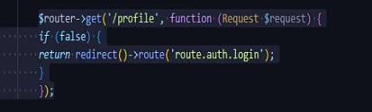

: DYNAMIC ROUTE DAN MIDDLEWARE
------------------------------------------------
Langkah 1) Menambahkan syntax dynamic route pada file web.php yang berfungsi untuk memanggil
user berdasarkan ID yang dimasukkan.
Memanggil user dengan ID 9 pada Postman.
Menambahkan syntax dynamic route pada file web.php yang berfungsi untuk mengambil
post dan comment berdasarkan ID yang dimasukkan. Pada syntax ini kita membuktikan
bahwa routes dapat memiliki lebih dari satu parameter.
Memanggil post dengan ID 1 dan comments dengan ID 5 pada Postman
Menambahkan syntax dynamic route pada file web.php yang berfungsi menyajikan
pilihan untuk memanggil seluruh user maupun berdasarkan ID-nya
Memanggil seluruh user pada Postman
Memanggil user berdasarkan ID-nya yaitu 2 pada Postman

Langkah 2) Menambahkan syntax aliases route pada file web.php yang berfungsi menampilkan pesan
“Berhasil login”. Mengakses fungsi /auth/login pada Postman
Mengakses endpoint /profile pada Postman. Karena pada langkah sebelumnya telah
diatur menjadi true, maka routes akan memanggil route.auth.login dan menampilkan
pesan seperti pada gambar.

Langkah 3) Menambahkan syntax group route pada file web.php.Mengakses prefix /users pada
Postman. Sesuai prefix yang ditentukan pada langkah sebelumnya, maka yang
ditampilkan adalah “GET /users”. Mengakses prefix /users/register pada Postman. Sesuai
prefix yang ditentukan pada langkah sebelumnya, maka yang ditampilkan adalah “GET
/users/test”.

Langkah 4) Membuat file AgeMiddleware.php pada direktori app/Http/Middleware, kemudian
menambahkan fungsi handle sesuai yang terdapat pada modul. Fungsi ini berisi
pengondisian dimana jika age < 17, maka akan menjalankan routes /fail.Mendaftarkan
AgeMiddleware pada file bootstrap/app.Menambahkan routes /fail dan middleware pada
routes /admin/home.Mengakses prefix /admin/home pada Postman. Mengakses prefix
/admin/home pada Postman. Mengakses prefix /admin/home pada Postman. Mengakses
prefix /admin/home pada Postman

